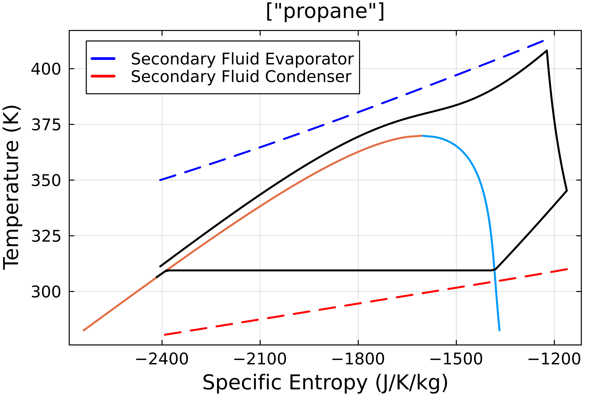

# Transcritical ORC

In the sections before we were able to model sub-critical cycles. This was achieved using a non-linear solver over the temperature profiles using bubble and dew points.

In the case of transcritical ORC, the system operates beyond the critical point. Hence the two-phase zone is eliminated. 
For solving such a system, we find the optimal cycle in the feasible zone using metaheuristic algorthims. 

```julia
using Carnot, Clapeyron, Metaheuristics

fluid = cPR("propane",idealmodel = ReidIdeal);

@info "Loading Cycle ..."
orc = TranscriticalORC(
    fluid = fluid,
    T_evap_in = 473.15,
    T_evap_out = 380,
    ΔT_sh_min = 10.0,
    T_cond_in = 280,
    T_cond_out = 310,
    ΔT_sc_min = 3.0,
    η_pump = 0.7,
    η_expander = 0.7,
    pp_evap = 5.0,
    pp_cond = 5.0
)


param = TranscriticalParamters(30,1.2) # (N,p_crit_ratio_max)

options = Metaheuristics.Options(f_tol_rel = 1e-2, f_tol = 1e-2,f_calls_limit = 10000,parallel_evaluation = false,verbose = true)
@info "Loading ECA..."
algo = ECA(options = options)

sol,η_opt =  Carnot.optimize(orc,algo,param)
```

The solution returns the `SolutionState` with `sol.x` being the vector of pressures, super and subcooling temperatures. And `sol.residuals` returns the pinch point temperature in the evaporator and condensor. 

The solution can be plotted as:

```julia
using Plots
default(
           fontfamily = "DejaVu Sans",
           guidefontsize = 14,
           tickfontsize = 11,
           legendfontsize = 11,
           titlefontsize = 14,
           dpi = 500,
           framestyle = :box
       )
fig = plot(fluid,sol,N = 100)
```

